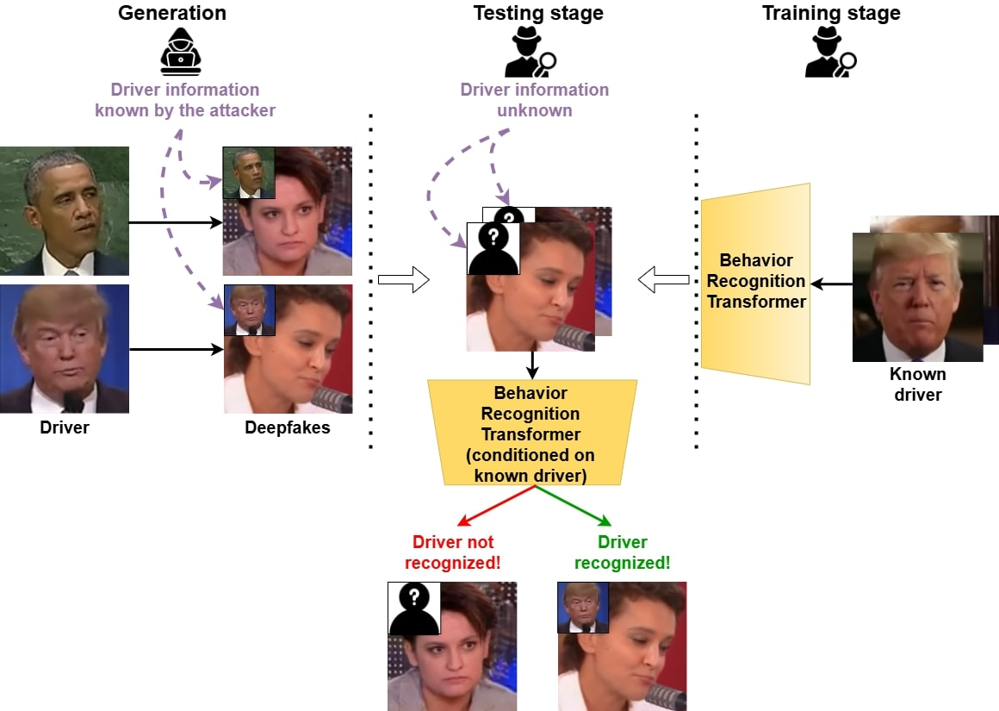

<!-- omit in toc -->
# BRT-driver-identitfication
Repository of the paper: "Who is driving this deepfake? Beyond Deepfake Detection With Driver Identification"



<!-- omit in toc -->
## Table of Contents
- [Installation](#installation)
  - [Libraries](#python-environment)
  - [Dataset formatting](#dataset-formatting)
- [Scripts](#scripts)
  - [Training](#training)
  - [Testing](#testing)
- [Citation](#citation)
- [Contributing](#contributing)


<!-- omit in toc -->
## Installation

### Python environment
- **TO DO**: Add requirements.txt

### Data preprocessin
To train your own model, process your data with the follosing steps:
  1. Dataset
After gathering videos from a specific Person Of Interest (POI), you can split them in two subsets: Training subset (80%) and testing subset (20%)
The counter examples used for training are the real videos (compression rate of c23) from [FaceForensics++](https://github.com/ondyari/FaceForensics). For the testing, we use the real videos of the celbrities from [Celeb-DF-v2](https://github.com/yuezunli/celeb-deepfakeforensics).

  3. Preprocessing
Before formatting all the videos, you need to crop the videos using the preprocessing script `crop_video.py` from [FOMM](https://github.com/AliaksandrSiarohin/first-order-model).

  4. Formatting
The videos must be split in the following format:
```
data
|-- POI
    |-- train
        |-- vid01.mp4
        |-- vid02.mp4
        |-- ...
    |-- test
        |-- vid81.mp4
        |-- vid82.mp4
        |-- ...
|-- other
    |-- train # List of FF++ real videos (c23)
        |-- 000.mp4
        |-- 001.mp4
        |-- ...
    |-- test # List of the CDFv2 real videos (celeb-real)
        |-- id0_0000_id1_0000.mp4
        |-- id0_0001_id2_0000.mp4
        |-- ...

```

This will allow you to train your network at learning the facial behavior of your POI

Next, for the driver identification step, gather a collection of deepfakes you want to test. The role of BRT, is to determine which deepfakes were generated using a video of your POI as a driving video.
The current script is made for performance evaluation, so you are supposed to know which deepfake were generated using a video of your POI.
Therefore, drop your videos in the following format:

```
data
|-- POI
|-- other
|-- deepfakes-from-POI
    |-- train
        |-- dummy_video.mp4 # In order to avoid error, put a random video here. (TO BE FIXED IN A LATER VERSION)
    |-- test
        |-- df01POI.mp4
        |-- df02POI.mp4
        |-- ...
|-- deepfake-from-other
    |-- train
        |-- dummy_video.mp4 # Can be the same as the one from data/deepfakes-from-POI/train
    |-- test
        |-- df01_otherA.mp4
        |-- df02_otherB.mp4
        |-- ...
```

<!-- omit in toc -->
## Scripts

### Training
The training works for a single GPU, parallel training have not been tested.
To train the model simply run:
```
export CUDA_VISIBLE_DEVICES=0
python head_mvt_classification_LIA.py --data_pos data/POI --data_neg data/other --epochs 101 --name POI --training
```

### Driver identification (Testing)
```
export CUDA_VISIBLE_DEVICES=0
python head_mvt_classification_LIA.py --data_pos data/deepfakes-from-POI --data_neg data/deepfakes-from-other --epochs 101 --name POI
```

<!-- omit in toc -->
## Citation
```
@inproceedings{
libourel2025who,
title={Who is driving this deepfake: Beyond Deepfake Detection With Driver Identification},
author={Alexandre Libourel and Jean-Luc Dugelay},
booktitle={International Joint Conference on Neural Networks},
year={2025}
}
```
<!-- omit in toc -->
## Contributing

Part of the code is adapted from [LIA](https://github.com/wyhsirius/LIA). We thank authors for their contribution to the community.
