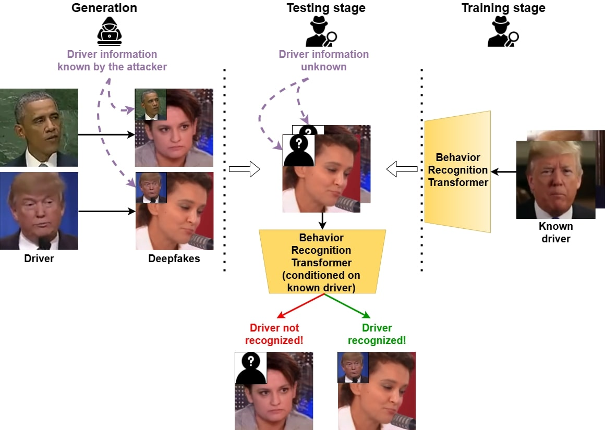

<!-- omit in toc -->
# BRT-driver-identification
Repository of the paper: "Who is driving this deepfake? Beyond Deepfake Detection With Driver Identification"



<!-- omit in toc -->
## Table of Contents
- [Installation](#installation)
  - [Libraries](#python-environment)
  - [Dataset metadata](#dataset-metadata-and-preprocessing)
- [Scripts](#scripts)
  - [Training](#training)
  - [Testing](#driver-identification-testing)
- [Citation](#citation)
- [Contributing](#contributing)


<!-- omit in toc -->
## Installation

### Python environment
- **TO DO**: Add requirements.txt

### Dataset metadata and preprocessing

Crop videos using the preprocessing script `crop_video.py` from
[FOMM](https://github.com/AliaksandrSiarohin/first-order-model). The current
classifier expects 256x256 videos at approximately 25 or 30 FPS, at least eight
seconds long.

Describe the videos in CSV or JSON metadata instead of passing positive/negative
folders. Each record specifies the driver identity, visible identity, original
driver recording, and split. The label is positive exactly when `driver_id`
matches `--poi`; folder names such as `drivingCDF` no longer determine labels.

See [the metadata schema and migration guide](docs/metadata.md) and
[example CSV](examples/metadata.csv). Existing video paths can be retained.
Group clips from the same original recording into the same split, including
any generated derivatives. Training uses `train` and `validation`; standalone
evaluation uses `test` and requires no training videos.

Check your metadata before loading videos or model weights:

```bash
python -m LIA_encoder.metadata --metadata metadata.csv --poi trump
```

The frozen LIA backbone requires `LIA_encoder/checkpoints/vox.pt`; see the
[upstream checkpoint download instructions](LIA_encoder/README.md#1-animation-demo).
This is distinct from the trained BRT classifier checkpoint supplied to `--ckpt`.

<!-- omit in toc -->
## Scripts

Run commands from the repository root. Training currently uses one CUDA GPU.
Use your actual POI identity and manifest paths in the following commands.

### Training

```bash
export CUDA_VISIBLE_DEVICES=0
python head_mvt_classification_LIA.py --metadata metadata.csv --poi trump --epochs 101 --name trump --training
```

You can supply several manifests: `--metadata genuine.csv generated.json`.
They are validated together, including checks for original driver recordings
appearing in different splits. Metadata paths are resolved relative to each
manifest, not the current working directory.

### Driver identification (Testing)

```bash
export CUDA_VISIBLE_DEVICES=0
python head_mvt_classification_LIA.py --metadata metadata.csv --poi trump --name trump-test --ckpt output/trump/ckpt/latest.pth
```

`--ckpt` is required for testing. `--eval_split validation` selects validation
instead of the default test split. During training the default is validation.
The old `--data_pos` and `--data_neg` options are replaced by `--metadata` and
`--poi`. No dummy videos are needed.

<!-- omit in toc -->
## Citation
```
@inproceedings{
libourel2025who,
title={Who is driving this deepfake: Beyond Deepfake Detection With Driver Identification},
author={Alexandre Libourel and Jean-Luc Dugelay},
booktitle={International Joint Conference on Neural Networks},
year={2025}
}
```
<!-- omit in toc -->
## Contributing

Part of the code is adapted from [LIA](https://github.com/wyhsirius/LIA). We thank authors for their contribution to the community.
